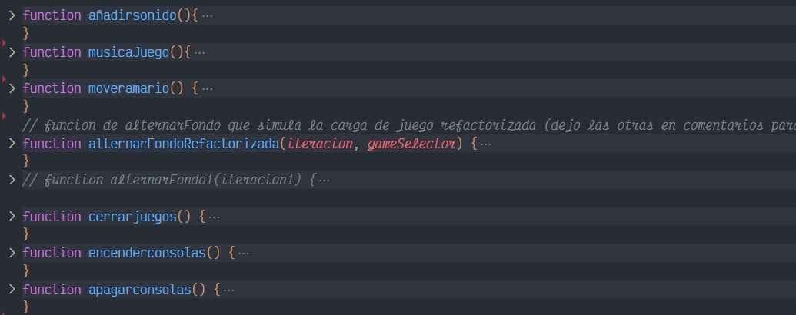
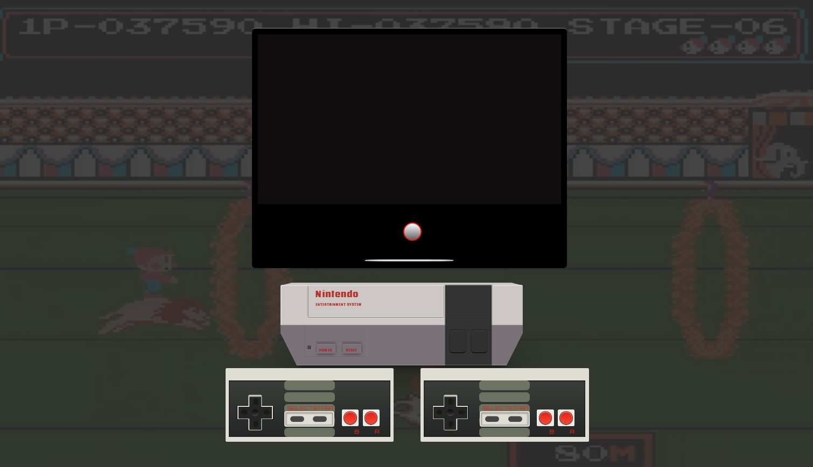
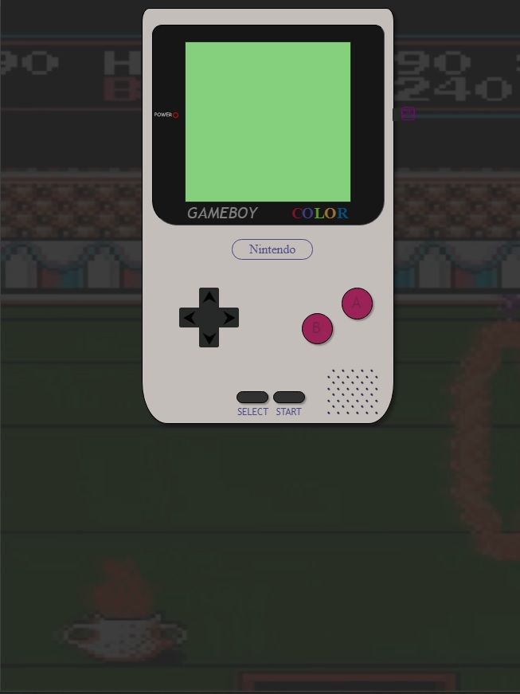

<h1 align="center"> RETRO STATION</h1>
​
​

Proyecto 2 - Videoconsola interactiva - Semana 2

​

Proyecto de videoconsola interactiva por Pascual Fernandez.
 
Desarrollada como formacion del Bootcamp de Full Stack Developer de Geekshubs Academy.

​
​

​
​
<h5 align="center"> Tecnologías utilizadas</h1>
​

JavaScript, HTML5, CSS3 y Bootstrap.

  <tr >
    <td valign="top"></td>
    <td valign="top"></td>
    <td valign="top"></td>
     <td valign="top"></td>
  

​
<a href = "https://github.com/PascuFCalvo/FSDVlcWeek1">Haz Click para acceder al repositorio</a>

                   
​
## Tabla de contenidos
​

- [👩🏻‍💻 Descripción del proyecto]
- [🔍 Observaciones]
- [⚖️ Licencia y Copyright]
- [📚Instrucciones]
​
​
### Descripción
​
Segundo proyecto creado en la segunda semana del bootcamp, centrado sobretodo en aprender el manejo del DOM/BOM, la creacion de funciones y seguir mejorando el aspecto del responsive de Bootstrap.

Mi proyecto consta de:
​
Una version de escritorio para navegador que imita a una consola NES con televiosion y mandos.

Una version mobile que imita a una GameBoy clasica.

​
### Observaciones
​
- ��Hay que refactorizar parte del codigo para no repetir algunas funciones
- ��Falta una opcion que guarde el estado de la pantalla en memoria para poder apagar la tele
y que se memorice al volver a encenderla
 
 

### Instrucciones

#####VERSION WEB
-��Es necesario encender la TV para que todo el sistema comience a funcionar.
 
 

### Agradecimientos

A toda esos heroes anonimos que suben trocitos de codigo a internet y hace la vida mucho mas facil a los estudintes.
​
​
### Licencia y copyright
📝 La licencia utilizada es una MIT License.
Este proyecto ha sido realizado pixel a pixel por mi, Pascual Fernandez, para completar la primera semana del BootCamp Full Stack de GeeksHubs Academy Valencia.